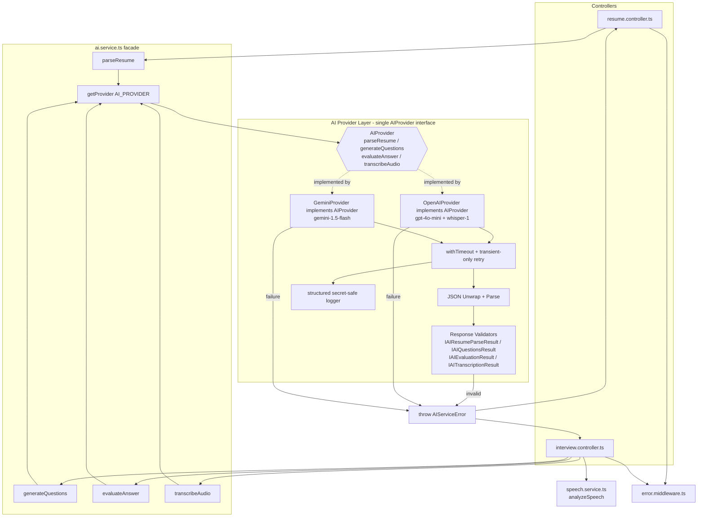
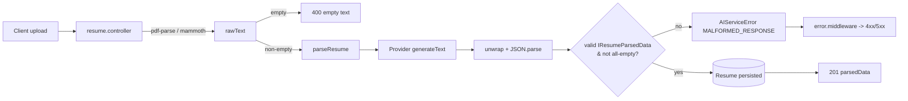

# AI Feature Fallback Fix — Bugfix Design

## Overview

The AI Coach backend exposes four AI-driven capabilities — resume parsing, interview question
generation, answer evaluation, and voice/speech analysis — that are supposed to be served by a
configured provider (OpenAI or Gemini, selected via `AI_PROVIDER`). The current implementation in
`backend/src/services/ai.service.ts` and `backend/src/services/speech.service.ts` wraps every
provider interaction in `try/catch` blocks that, on any failure, **silently return fabricated
defaults** (`getDefaultResumeData`, `getDefaultQuestions`, `getDefaultEvaluation`,
`[Transcription unavailable]`, and zeroed speech metrics). The `evaluateAnswer` success path
additionally masks missing fields with `|| 70`. The result is a *silent fallback* defect class:
genuine failures (bad key, empty extraction, unparseable JSON, transcription failure) are swallowed
and returned as if they were real provider output, and callers persist them as successful results.

The fix strategy is **not** to add more features. It is to make real provider calls succeed for
valid inputs and to make failures **explicit and observable** rather than masked as fabricated
success. Concretely, this design:

- Introduces a typed `AIServiceError` with categories so failures propagate to the existing
  `error.middleware.ts` with meaningful HTTP statuses instead of being swallowed.
- Replaces the untyped `Promise<any>` return types in `ai.service.ts` (`parseResume`,
  `evaluateAnswer`, and the `resumeData?: any` / `(e: any)` parameters) with explicit, strongly
  typed AI response contracts (`IAIResumeParseResult`, `IAIQuestionsResult`, `IAIEvaluationResult`,
  `IAITranscriptionResult`). No `any` types remain in the AI path; every provider response is
  validated against its typed contract before it is returned to the application.
- Introduces a **single provider interface** — `AIProvider` — that `OpenAIProvider` and
  `GeminiProvider` implement. The rest of the application (controllers, `ai.service.ts` facade)
  never imports the OpenAI or Gemini SDKs directly; today `ai.service.ts` imports both SDKs and
  branches on `AI_PROVIDER` inline, which the fix removes.
- Removes the silent `getDefault*` returns from the failure paths and the `|| 70` field coercion.
  Every former silent fallback becomes exactly one of: (a) a successful, validated provider
  response, (b) an explicit degraded-mode result clearly flagged in the payload, or (c) an explicit
  typed AI error — never fabricated success.
- Adds a dedicated response validator per response type against the existing `IResumeParsedData` /
  `IEvaluation` / `IQuestion[]` / `ISpeechAnalysis` contracts before persistence.
- Strips provider markdown wrappers robustly before JSON parsing.
- Adds fail-fast startup key/provider/model validation and reads `AI_PROVIDER` through the provider
  factory so switching providers requires no code change.
- Retries only transient failures (timeout, rate limiting, temporary network) and never retries
  auth, config, malformed-prompt, or invalid-response failures.
- Adds structured, secret-safe observability logging (provider, model, latency, retry count,
  parsing/validation failures — never keys, JWTs, or user content).
- Preserves all existing success-path behavior, response shapes, and non-AI functionality unchanged.

Existing verified infrastructure (backend startup, MongoDB Atlas, auth/JWT, authorization,
resume upload transport, interview creation/persistence/completion, analytics persistence, REST
routing, DB models) is **out of scope** and is not redesigned except where an AI fix forces a
minimal, clearly-noted touch (e.g. controllers must stop persisting fabricated data).

## Glossary

- **Bug_Condition (C)**: The condition that triggers the bug — a genuine AI/speech failure or
  degenerate provider result is masked as a successful fabricated default instead of being
  surfaced. Formally captured by `isBugCondition` (see Bug Details).
- **Property (P)**: The desired behavior — on `isBugCondition` inputs the system surfaces an
  explicit, observable error; on valid inputs it returns real, input-reflecting, differentiated
  provider output.
- **Preservation**: Existing success-path behavior, response shapes, short-answer short-circuit,
  score clamping, and all non-AI functionality that must remain unchanged.
- **F**: The current AI/speech service functions that swallow failures and return fabricated
  defaults.
- **F'**: The fixed functions that return real provider output on success and throw typed errors
  on failure.
- **AIProvider**: The *single* provider interface exposed by the provider layer, with exactly four
  feature methods — `parseResume`, `generateQuestions`, `evaluateAnswer`, `transcribeAudio`.
  `OpenAIProvider` and `GeminiProvider` implement it. No other module imports the OpenAI/Gemini
  SDKs directly.
- **AI response contracts**: The new strongly typed interfaces `IAIResumeParseResult`,
  `IAIQuestionsResult`, `IAIEvaluationResult`, `IAITranscriptionResult` returned by `AIProvider`
  methods. They replace the current `Promise<any>` return types and align with the existing
  `IResumeParsedData` / `IQuestion` / `IEvaluation` / `ISpeechAnalysis` domain types.
- **AIServiceError**: New typed error class carrying a failure `category` and HTTP `status`,
  consumed by the existing central `errorHandler`.
- **Degraded / fallback mode**: An *intentional, documented, explicitly-flagged* non-provider
  result (e.g. an `isFallback: true` flag in the payload). Not used by default in this design; if
  ever enabled it must be flagged and never presented as genuine provider output. Every former
  silent fallback resolves to exactly one of three outcomes: a validated success, an explicit
  flagged degraded result, or a typed error.
- **IResumeParsedData / IQuestion / IEvaluation / ISpeechAnalysis**: Existing domain type contracts
  in `backend/src/types/index.ts` that the fixed code must continue to satisfy and that the new AI
  response contracts wrap.

## Bug Details

### Bug Condition

The bug manifests whenever an AI feature invocation encounters a genuine failure or a degenerate
provider result and the service masks it as a successful, fabricated default rather than surfacing
it. The affected functions are `parseResume`, `generateQuestions`, `evaluateAnswer`, and
`transcribeAudio` (plus `analyzeSpeech` consuming a failed transcription).

**Formal Specification:**
```
FUNCTION isBugCondition(X)
  INPUT: X of type AIFeatureInvocation
    // X captures: feature (parseResume | generateQuestions | evaluateAnswer | transcribeAudio),
    // inputs (resume text, role/type/difficulty, question+answer, audio file),
    // provider state (provider selection + key validity + provider response)
  OUTPUT: boolean

  RETURN (X.extractedText is empty for a non-empty source)
      OR (X.providerCall throws)                                  // network / auth / quota / timeout
      OR (X.providerResponse is unparseable)                      // markdown-wrapped / non-JSON
      OR (X.providerResponse is missing required fields)          // partial evaluation, empty array
      OR (X.transcription = '[Transcription unavailable]')        // transcription failure
      OR (X.providerKey is missing OR invalid OR disabled)
END FUNCTION
```

### Examples

- **Resume (silent empty):** A resume clearly listing skills, education, and projects is uploaded;
  the provider call throws (invalid key). Expected: explicit error surfaced to the client and
  logged; nothing persisted. Actual: `getDefaultResumeData()` returns `{skills:[],education:[],
  experience:[],certifications:[],projects:[]}` and `resume.controller.ts` stores it as success.
- **Resume (markdown-wrapped JSON):** Provider returns ` ```json {...} ``` `. The current regex
  `/\{[\s\S]*\}/` may capture the object, but any leading/trailing prose or malformed fences can
  cause a parse failure that silently falls back to empty arrays. Expected: robust unwrap + parse,
  or explicit error.
- **Questions (generic):** Requesting questions for "Software Engineer" vs "Data Analyst" vs
  "UI/UX Designer" under a forced failure yields the same `getDefaultQuestions` list, not
  differentiated by role/type/difficulty. Expected: provider-generated, differentiated questions,
  or explicit error.
- **Evaluation (identical 70s):** Excellent, average, and poor answers all return
  `{score:70, relevance:70, clarity:70, communication:70, technicalAccuracy:70, confidence:70}`
  because of `getDefaultEvaluation()` on failure and `|| 70` coercion on partial success.
  Expected: scores that vary with answer quality, or explicit error / invalid-response error.
- **Voice (fake success):** Transcription throws → `[Transcription unavailable]` →
  `analyzeSpeech` returns all-zero metrics → both stored as a successful answer. Expected: explicit
  transcription error surfaced; no zeroed metrics persisted as success.
- **Edge — short answer:** An answer with fewer than 10 non-whitespace characters must continue to
  short-circuit **without** calling the provider (this is *not* a bug condition; preserved).

## Expected Behavior

### Preservation Requirements

**Unchanged Behaviors:**
- Resume upload/parse endpoint and its response shape (`{ resumeId, fileUrl, parsedData }`) for
  valid providers and successful extraction (bugfix clause 3.1).
- Question generation returns exactly the requested `count` of questions in the existing
  `{ text, type }` shape, respecting the requested interview type (clause 3.2).
- The short-answer short-circuit in `evaluateAnswer`: answers with fewer than 10 non-whitespace
  characters do not call the provider (clause 3.3).
- `analyzeSpeech` computation for valid, non-empty transcriptions: filler-word count, speech rate,
  pause count, confidence score, and the `ISpeechAnalysis` shape are unchanged (clause 3.4).
- Numeric score clamping to the 0–100 range on valid, complete provider responses (clause 3.5).
- All non-AI endpoints — authentication, analytics, storage, and non-AI controller logic — behave
  exactly as before (clause 3.6).

**Scope:**
All inputs where `isBugCondition(X)` is false and the provider is valid must be completely
unaffected by this fix. This includes valid resume extractions, valid question requests, valid
answer evaluations, valid transcriptions, short-answer short-circuits, and every non-AI code path.

**Note:** The actual expected correct behavior for buggy inputs is defined in the Correctness
Properties section (Property 1). This section focuses on what must NOT change.

## Hypothesized Root Cause

Based on the bug analysis and the actual code, the root causes are:

1. **Silent fallback in catch blocks (primary):** Each of `parseResume`, `generateQuestions`,
   `evaluateAnswer`, and `transcribeAudio` catches all errors and returns a fabricated default
   (`getDefault*` / `[Transcription unavailable]`) instead of propagating. Failures are logged to
   `console.error` only and never reach the client or `error.middleware.ts`.

2. **Field coercion masking partial responses:** `evaluateAnswer`'s success path uses
   `evaluation.score || 70` (and the same for every metric). A missing or `0` field is silently
   rewritten to `70`, so partial/malformed provider responses look like complete, average
   evaluations. The guard `typeof evaluation.score === 'number'` is too weak — it accepts a lone
   `score` while fabricating all other metrics.

3. **Fragile JSON extraction:** The `/\{[\s\S]*\}/` and `/\[[\s\S]*\]/` regexes attempt to recover
   JSON from provider output, but markdown code fences, multiple JSON blocks, or trailing prose can
   defeat them, sending otherwise-recoverable responses down the silent-fallback path.

4. **No response validation against contracts:** Parsed objects are never validated against
   `IResumeParsedData` / `IEvaluation` / `IQuestion[]` before being returned and persisted, so
   empty or structurally-wrong results are accepted.

5. **Provider config read once, never validated:** `const provider = process.env.AI_PROVIDER ||
   'openai'` is evaluated once at module load; clients are created lazily with possibly-empty keys
   (`process.env.GEMINI_API_KEY || ''`). There is no startup validation that the selected
   provider's key or model configuration is present, so missing/invalid keys only manifest as
   swallowed runtime failures on the first request rather than failing fast at boot.

6. **Voice pipeline treats sentinel as data:** `transcribeAudio` returns the literal
   `[Transcription unavailable]` on failure, and `analyzeSpeech` explicitly treats that sentinel
   (and empty strings) as a valid "zero" input, propagating a fake-success result into interview
   scoring and analytics.

7. **Untyped responses (`Promise<any>`):** `parseResume` and `evaluateAnswer` are declared
   `Promise<any>`, `generateQuestions` takes `resumeData?: any` and maps `(e: any)`, and parsed
   provider JSON is never checked against a contract. The absence of types is *why* empty or
   partial structures pass through undetected — there is no compile-time or runtime gate on shape.

8. **Direct SDK coupling / no abstraction:** `ai.service.ts` imports both the `openai` and
   `@google/generative-ai` SDKs and branches on `AI_PROVIDER` inline inside `callAI` and
   `transcribeAudio`. Provider concerns (auth, timeouts, retries, model selection) are scattered
   and duplicated, and there is no single seam at which to validate, log, or retry.

## Correctness Properties

Property 1: Bug Condition — No Silent Fallback; Real Differentiated Output

_For any_ AI feature invocation where the bug condition holds (`isBugCondition` returns true) — a
genuine provider/extraction/parse/transcription failure or a missing/invalid key — the fixed
functions SHALL surface an explicit, observable error (a typed `AIServiceError` propagated to the
central error handler and structured log) and SHALL NOT return or persist fabricated default data
as if it were genuine provider output. Conversely, _for any_ valid invocation where the bug
condition does NOT hold and the provider is valid, the fixed functions SHALL return real
provider-generated output that reflects the actual input (non-empty parsed resume), varies with
input quality (evaluation scores differ across excellent/average/poor answers), and is
differentiated by role, type, and difficulty (questions differ per role).

**Validates: Requirements 2.1, 2.2, 2.3, 2.4, 2.5, 2.6, 2.7**

Property 2: Preservation — Valid-Input Behavior Unchanged

_For any_ input where the bug condition does NOT hold (`isBugCondition` returns false), the fixed
functions SHALL produce the same observable result as the original functions, preserving: the
resume upload/parse response shape, the exact requested `count` and `{ text, type }` question
shape, the sub-10-character short-answer short-circuit (no provider call), the `analyzeSpeech`
computation and `ISpeechAnalysis` shape for valid transcriptions, the 0–100 score clamping on
valid complete responses, and all non-AI (auth, analytics, storage) behavior.

**Validates: Requirements 3.1, 3.2, 3.3, 3.4, 3.5, 3.6**

## Fix Implementation

### Architecture Overview

The fix introduces a thin **AI Provider Layer** and an **error/validation spine** while keeping the
public function signatures of `ai.service.ts` intact so controllers change minimally.

Controllers and the `ai.service.ts` facade depend on the **single `AIProvider` interface** only —
they never import the OpenAI or Gemini SDKs. The facade selects one concrete implementation
(`OpenAIProvider` or `GeminiProvider`) via `getProvider(AI_PROVIDER)`. Each provider method returns
a strongly typed, validated AI response contract or throws a typed `AIServiceError`.



### Typed AI Response Contracts

Every `AIProvider` method returns an explicit interface — no `any`. These are added to
`backend/src/types/index.ts` alongside the existing domain types and wrap them so the AI layer and
the persistence layer share a single source of truth. An optional `isFallback` flag exists solely
to make any *explicit degraded-mode* result self-describing; on the normal success path it is
absent or `false`, and it is never set silently.

```typescript
// Resume parsing — wraps the existing IResumeParsedData contract.
export interface IAIResumeParseResult {
  parsedData: IResumeParsedData;   // skills[], education[], experience[], certifications[], projects[]
  provider: 'openai' | 'gemini';
  model: string;
  isFallback?: false;              // success path is never a fallback
}

// Question generation — an array of the existing IQuestion contract.
export interface IAIQuestionsResult {
  questions: IQuestion[];          // each { text, type: 'behavioral' | 'technical' | 'hr' }
  provider: 'openai' | 'gemini';
  model: string;
  isFallback?: false;
}

// Answer evaluation — aligns exactly with the existing IEvaluation contract.
export interface IAIEvaluationResult {
  evaluation: IEvaluation;         // score/relevance/clarity/communication/technicalAccuracy/confidence + strengths/improvements
  provider: 'openai' | 'gemini';
  model: string;
  isFallback?: false;
}

// Voice / transcription — the raw transcript feeding analyzeSpeech (ISpeechAnalysis).
export interface IAITranscriptionResult {
  transcript: string;              // real transcription only; never the '[Transcription unavailable]' sentinel
  provider: 'openai' | 'gemini';
  model: string;
  durationMs: number;
  isFallback?: false;
}
```

The public `ai.service.ts` functions change their signatures from `Promise<any>` /
`Promise<{ text; type }[]>` / `Promise<string>` to return these typed results (the facade may
unwrap `parsedData` / `questions` / `evaluation` / `transcript` for controllers to preserve the
existing success-path shapes — see Migration Impact). The `resumeData?: any` parameter of
`generateQuestions` becomes `resumeData?: IResumeParsedData` and the `(e: any)` map becomes a typed
`experience` element.

### Single Provider Interface

```typescript
export interface AIProvider {
  parseResume(rawText: string): Promise<IAIResumeParseResult>;
  generateQuestions(
    role: string, type: string, difficulty: string,
    resumeData: IResumeParsedData | undefined, count: number
  ): Promise<IAIQuestionsResult>;
  evaluateAnswer(
    question: string, answer: string, role: string, difficulty: string
  ): Promise<IAIEvaluationResult>;
  transcribeAudio(audioFilePath: string): Promise<IAITranscriptionResult>;
}
```

`OpenAIProvider` and `GeminiProvider` are the only classes that import their respective SDKs and
encapsulate model selection (`gpt-4o-mini` + `whisper-1` / `gemini-1.5-flash`), prompt assembly,
timeout, transient-only retry, JSON unwrap, validation, and structured logging. `getProvider()`
reads `AI_PROVIDER` and returns the matching implementation, throwing `AIServiceError('CONFIG')`
for unknown values. The `ai.service.ts` facade delegates to the selected `AIProvider` and no longer
contains any provider-specific branching or SDK imports.

### Changes Required

Assuming the root-cause analysis is correct:

**File: `backend/src/services/ai.service.ts`**

1. **Typed error class.** Introduce `AIServiceError extends Error` with:
   - `category`: `'CONFIG' | 'AUTH' | 'QUOTA' | 'TIMEOUT' | 'MALFORMED_RESPONSE' | 'EMPTY_INPUT' |
     'PROVIDER_UNAVAILABLE' | 'TRANSCRIPTION_FAILED'`.
   - `status`: HTTP status the central handler will emit (e.g. `502` provider failure, `503`
     unavailable/timeout, `500` config, `422` malformed response, `400` empty input).
   - `providerContext`: `{ provider, model, durationMs }` (no secrets).
   The existing `error.middleware.ts` already keys off `err.status || err.statusCode`, so
   propagating this error yields a meaningful HTTP response with no middleware change required.

2. **Single provider interface.** Introduce the `AIProvider` interface (four feature methods:
   `parseResume`, `generateQuestions`, `evaluateAnswer`, `transcribeAudio`) with `OpenAIProvider`
   and `GeminiProvider` implementations — the *only* modules that import the OpenAI /
   `@google/generative-ai` SDKs. A `getProvider()` factory reads `AI_PROVIDER` (re-read via the
   factory, not captured once at module load) and returns the matching provider; unknown values
   throw `AIServiceError('CONFIG')`. `ai.service.ts` becomes a thin facade over
   `getProvider().<method>(...)` and drops all inline SDK imports and `provider === 'gemini'`
   branches. Each method returns its typed contract (`IAIResumeParseResult`, etc.).

3. **Timeout + transient-only retry + logging.** Wrap each provider call in `withTimeout(ms)`
   (configurable, e.g. `AI_TIMEOUT_MS`, default ~20s) and a bounded retry (e.g. 1–2 retries with
   exponential backoff) that fires **only for transient categories** — `TIMEOUT`,
   `PROVIDER_UNAVAILABLE` (temporary network failure), and `QUOTA` (HTTP 429 rate limiting).
   Non-transient failures are **never retried**: `AUTH` (invalid/disabled API key), `CONFIG`
   (invalid provider/model), `EMPTY_INPUT` / malformed prompt, and `MALFORMED_RESPONSE` (invalid
   provider response) fail immediately. This categorization is explicit in a
   `isTransient(category)` helper so a retried call cannot mask a deterministic failure. Emit a
   structured log line per attempt including the retry count (see Observability).

4. **Remove silent fallbacks.** Delete the `catch → getDefault*` returns and the
   `if (jsonMatch) {...} else return getDefault*` branches. On any failure or unrecoverable parse,
   throw a categorized `AIServiceError`. The `getDefault*` helpers are removed (or, if a documented
   flagged fallback is ever desired, gated behind an explicit `AI_ALLOW_FALLBACK` flag and marked
   in the payload — off by default; not used in this design).

5. **Robust JSON unwrap.** Add a `parseJsonFromModel(raw, shape)` helper that strips markdown code
   fences (` ```json … ``` `), trims prose, and parses. On failure it throws
   `AIServiceError('MALFORMED_RESPONSE')`.

6. **`parseResume` validation.** After parsing, validate against `IResumeParsedData`: all five
   fields present and array-typed. If the source `rawText` is non-empty but the parse yields a
   fully-empty structure, treat it as `MALFORMED_RESPONSE` (a valid resume must not silently parse
   to all-empty). Return the validated structure only.

7. **`generateQuestions` validation.** Require a non-empty array of `{ text, type }` with valid
   `type ∈ {behavioral, technical, hr}`; if the provider returns fewer than `count`, treat as
   `MALFORMED_RESPONSE` (do not pad with generic defaults). Preserve the `slice(0, count)` behavior
   for over-generation. Preserve resume-derived prompt enrichment.

8. **`evaluateAnswer` fix.** Keep the sub-10-char short-circuit (clause 3.3) but return an explicit
   *short-answer* result rather than the all-70 default — a clearly-flagged minimal evaluation (or
   a validation error), never a fabricated 70. On the success path, **remove `|| 70`**: require all
   six numeric metrics to be present and numeric; if any is missing, throw
   `AIServiceError('MALFORMED_RESPONSE')`. Retain 0–100 clamping (clause 3.5). Retain
   `strengths`/`improvements` array validation.

9. **`transcribeAudio` fix.** Remove the `catch → '[Transcription unavailable]'` returns. On
   failure throw `AIServiceError('TRANSCRIPTION_FAILED')`. Keep the file-not-found throw. Return
   the real transcription only.

10. **Startup configuration validation (fail fast).** Expand and export `validateAIConfig()`,
    invoked during `server.ts` startup *before* the server accepts traffic. It asserts, and
    **fails fast** (process exits / startup aborts with a clear `CONFIG` error) when any of the
    following hold — it does not defer these to the first AI request:
    - `AI_PROVIDER` is missing or not one of `{'openai', 'gemini'}` (invalid provider).
    - The selected provider's required API key is absent or empty (`OPENAI_API_KEY` for `openai`,
      `GEMINI_API_KEY` for `gemini`).
    - The model configuration for the selected provider is invalid (e.g. an overridden
      `OPENAI_MODEL` / `GEMINI_MODEL` / `AI_TIMEOUT_MS` that is empty or non-parseable).
    Validation checks only *presence and shape* of configuration; it never logs key values.

**File: `backend/src/services/speech.service.ts`**

11. **Stop treating the sentinel as data.** `analyzeSpeech` no longer needs to special-case
    `[Transcription unavailable]` because `transcribeAudio` will throw before reaching it. Preserve
    the empty-string guard only for genuinely empty valid input if still reachable; keep all
    computation logic for valid transcriptions unchanged (clause 3.4). The controller must not call
    `analyzeSpeech` with a failed transcription because the transcription error will already have
    propagated.

**File: `backend/src/controllers/resume.controller.ts`** (minimal, forced)

12. **Stop persisting fabricated data.** Because `parseResume` now throws on failure, wrap the call
    so the thrown `AIServiceError` propagates to `errorHandler` (via `next(err)` or the existing
    `catch` that already returns 500 — but with the typed status). Do not persist a resume document
    when parsing fails. Preserve the existing empty-text 400 and the success response shape
    (clause 3.1).

**File: `backend/src/controllers/interview.controller.ts`** (minimal, forced)

13. **Propagate AI errors.** `startInterview`, `submitTextAnswer`, and `submitVoiceAnswer` must let
    `AIServiceError` from `generateQuestions` / `evaluateAnswer` / `transcribeAudio` surface with
    its typed status instead of persisting fabricated evaluations/answers. For voice, a
    transcription failure must abort the answer submission (no zeroed `speechAnalysis` persisted).
    Interview averaging, persistence, completion, and `saveAnalytics` remain unchanged for
    successful evaluations (clause 3.6). The `(ans.evaluation?.score || 0)` averaging stays as-is
    since it only runs over successfully-stored answers.

**File: `backend/src/server.ts`** — call `validateAIConfig()` during `startServer()`.

### Data Flow (Resume Parsing)



### Response Validators (one per response type)

Every provider response is validated **before persistence**. Each validator either returns the
typed result or throws `AIServiceError('MALFORMED_RESPONSE')` (HTTP 502). Validation runs inside
the provider layer immediately after JSON unwrap/parse, so malformed output can never reach a
controller or the database.

- **`validateResumeParse(raw): IAIResumeParseResult`** — asserts the parsed object matches
  `IResumeParsedData`: the `skills`, `education`, `experience`, `certifications`, and `projects`
  fields all **exist and are arrays**; specifically the `skills` array, the `education` array, and
  the `projects` array are present. If the source `rawText` was non-empty but the parse yields a
  fully-empty structure (all arrays empty), it is rejected as malformed (a real resume must not
  silently parse to nothing).
- **`validateQuestions(raw, count): IAIQuestionsResult`** — asserts a non-empty array of
  `{ text, type }` where `text` is a non-empty string and `type ∈ {behavioral, technical, hr}`, the
  **minimum question count** (`>= count`) is met, and the content is role-specific (not the removed
  generic default set). Over-generation is `slice`d to `count`; under-generation or wrong types are
  rejected. No generic default padding.
- **`validateEvaluation(raw): IAIEvaluationResult`** — asserts all six numeric metrics (`score`,
  `relevance`, `clarity`, `communication`, `technicalAccuracy`, `confidence`) **exist and are
  numbers** (no `|| 70` substitution), each is (or is clamped) within **0–100**, and both
  `strengths` and `improvements` are string arrays. A missing metric is rejected as malformed.
- **`validateTranscription(raw): IAITranscriptionResult`** — asserts a non-empty transcript string
  and that it is not the `[Transcription unavailable]` sentinel; a failed/empty transcription is a
  `TRANSCRIPTION_FAILED` error, never a stored value.

## Testing Strategy

### Validation Approach

The strategy follows a two-phase approach: first surface counterexamples that demonstrate the
silent-fallback bug on the **unfixed** code, then verify the fix produces real output on success
and explicit errors on failure while preserving all valid-input behavior. Because these are
AI-driven features, tests exercise **live OpenAI/Gemini calls, real PDF resumes, real interview
answers, and real voice recordings** wherever feasible, using mocks only to deterministically
*force failures* (invalid key, throwing provider, malformed response) — not to simulate success.

### Exploratory Bug Condition Checking

**Goal:** Surface counterexamples demonstrating the bug BEFORE implementing the fix, and confirm or
refute the root-cause hypotheses. If refuted, re-hypothesize.

**Test Plan:** Invoke each AI function against the unfixed code under forced-failure conditions and
observe that fabricated defaults are returned instead of errors.

**Test Cases:**
1. **Resume silent-empty:** Parse a real PDF resume (from `backend/uploads/resumes/`) with an
   invalid/forced-throwing provider; observe all-empty arrays returned and persisted (will
   demonstrate bug on unfixed code).
2. **Markdown-wrapped JSON:** Feed a provider response wrapped in ` ```json ``` `; observe parse
   failure → silent empty fallback (may demonstrate bug on unfixed code).
3. **Generic questions:** Call `generateQuestions` for Software Engineer, Data Analyst, UI/UX
   Designer, Product Manager under forced failure; observe identical `getDefaultQuestions` output
   (will demonstrate bug).
4. **Identical evaluations:** Call `evaluateAnswer` with excellent, average, and poor real answers
   under forced failure, and with a partial provider response to trigger `|| 70`; observe all-70
   metrics (will demonstrate bug).
5. **Transcription fallback:** Call `transcribeAudio` under forced failure; observe
   `[Transcription unavailable]` and subsequent all-zero `analyzeSpeech` metrics stored as success
   (will demonstrate bug).
6. **Provider switch / bad key:** Set `AI_PROVIDER=gemini` (then `openai`) with an invalid key;
   observe fabricated defaults instead of a config/auth error (will demonstrate bug).

**Expected Counterexamples:** fabricated `getDefault*` / zeroed / `[Transcription unavailable]`
results returned as genuine success. Likely causes: catch-block silent fallback, `|| 70` coercion,
fragile JSON regex, no response validation, unvalidated provider config.

### Fix Checking

**Goal:** For all inputs where the bug condition holds, the fixed function surfaces an explicit
error; for valid inputs, it produces real, input-reflecting, differentiated output.

**Pseudocode:**
```
FOR ALL X WHERE isBugCondition(X) DO
  ASSERT throws AIServiceError(category)         // no fabricated default returned or persisted
END FOR

FOR ALL X WHERE NOT isBugCondition(X) AND provider_valid(X) DO
  result := F'(X)
  ASSERT result reflects_actual_input(X)         // non-empty parsed resume
     AND result varies_with_input_quality(X)      // eval scores differ by answer quality
     AND result differentiated_by(role, type)     // questions differ per role
END FOR
```

### Preservation Checking

**Goal:** For all inputs where the bug condition does NOT hold, the fixed function produces the same
result as the original.

**Pseudocode:**
```
FOR ALL X WHERE NOT isBugCondition(X) DO
  ASSERT F(X) = F'(X)
END FOR
```

**Testing Approach:** Property-based testing is recommended for preservation because it generates
many inputs across the domain, catches edge cases manual tests miss, and provides strong guarantees
that valid-input behavior is unchanged. Observe behavior on the UNFIXED code first, then capture it
in property tests.

**Test Cases:**
1. **Short-answer short-circuit:** Property test over answers with fewer than 10 non-whitespace
   characters — verify no provider call and preserved handling (clause 3.3).
2. **`analyzeSpeech` computation:** Property test over random valid transcriptions + durations —
   verify filler count, speech rate, pause count, confidence, and `ISpeechAnalysis` shape are
   identical before and after the fix (clause 3.4).
3. **Score clamping:** Property test over valid complete evaluation responses with out-of-range
   metrics — verify clamping to 0–100 is preserved (clause 3.5).
4. **Question count/shape:** Property test over valid responses — verify exactly `count` questions
   in `{ text, type }` shape with valid types (clause 3.2).
5. **Non-AI endpoints:** Verify auth, analytics, and storage flows are byte-for-byte unaffected
   (clause 3.6).

### Unit Tests

- Typed error mapping: each `AIServiceError.category` maps to the expected HTTP status via
  `error.middleware.ts`.
- `parseJsonFromModel`: unwraps fenced/pretty/prose-wrapped JSON; throws `MALFORMED_RESPONSE` on
  unrecoverable input.
- `evaluateAnswer`: missing metric field → `MALFORMED_RESPONSE` (no `|| 70`); all-present →
  clamped, validated result.
- `transcribeAudio`: forced failure → `TRANSCRIPTION_FAILED`; file-not-found → existing throw.
- `validateAIConfig`: missing key / unknown `AI_PROVIDER` → `CONFIG` error at startup.

### Property-Based Tests

- Generate random valid evaluation payloads and assert clamping + validation invariants.
- Generate random valid transcriptions and assert `analyzeSpeech` output equals the original
  implementation (preservation).
- Generate random short answers and assert the no-provider-call short-circuit.

### Integration Tests

- **Live resume parse:** Upload each real PDF in `backend/uploads/resumes/` with a valid provider;
  assert non-empty, contract-valid `parsedData` and preserved response shape.
- **Live question differentiation:** Request questions for multiple roles/types/difficulties with a
  valid provider; assert outputs differ across roles and match requested `count`/type.
- **Live evaluation variance:** Submit excellent/average/poor answers to a real interview; assert
  scores vary meaningfully and are not all-70.
- **Live voice flow:** Submit a real audio recording; assert a real transcription, computed
  `ISpeechAnalysis`, and a valid `IEvaluation`; on forced transcription failure assert the answer
  submission aborts with an explicit error and persists nothing.
- **Provider switch:** Run the resume + question + evaluation suite with `AI_PROVIDER=openai` and
  then `AI_PROVIDER=gemini` (valid keys) with no code change; with an invalid key assert a
  meaningful config/auth error surfaces instead of defaults.

## Component Design Detail

### 1. Resume Parsing Pipeline
`upload → pdf-parse/mammoth extraction → text validation (existing 400 on empty) → AI prompt →
structured JSON generation → unwrap+parse → validate against IResumeParsedData (all five fields,
array-typed, not all-empty for non-empty source) → persist → on failure throw AIServiceError`. The
controller stops persisting when parsing throws.

### 2. Interview Question Generation
Prompt retains role/type/difficulty/resume enrichment. Validation requires a non-empty
`{ text, type }[]` with valid types and at least `count` items; over-generation is `slice`d;
under-generation or malformed output → `MALFORMED_RESPONSE`. **Explicit fallback policy:** no
generic default padding; failures surface as errors.

### 3. Answer Evaluation
Evaluation prompt unchanged. Scoring model: six numeric metrics + `strengths`/`improvements`.
Structured output validated against `IEvaluation`; all metrics required and numeric (no `|| 70`);
clamped 0–100. Malformed/partial → `MALFORMED_RESPONSE`; provider failure → `PROVIDER_UNAVAILABLE`/
`AUTH`/`QUOTA`/`TIMEOUT`. Identical default scores are eliminated; any flagged fallback (off by
default) must be explicitly marked and never presented as genuine.

### 4. Voice Analysis
`transcribeAudio` (Whisper for OpenAI, `gemini-1.5-flash` inline audio for Gemini) returns a real
transcription or throws `TRANSCRIPTION_FAILED`. `analyzeSpeech` computes metrics only from valid
transcriptions (logic unchanged). Confidence and metrics integrate into interview scoring exactly
as today for successful answers.

### 5. AI Provider Layer
A **single `AIProvider` interface** (`parseResume`, `generateQuestions`, `evaluateAnswer`,
`transcribeAudio`) implemented by `OpenAIProvider` and `GeminiProvider` — the only modules that
import the provider SDKs. `getProvider()` reads `AI_PROVIDER` through the factory and returns the
matching implementation; the `ai.service.ts` facade and controllers depend on the interface alone.
Each provider encapsulates model selection, prompt assembly, `withTimeout`, transient-only retry,
JSON unwrap, per-type validation, and structured logging; rate-limit (429) is mapped to `QUOTA`
with backoff. Startup `validateAIConfig()` fails fast on missing keys, unknown provider, or invalid
model configuration.

### 6. Observability
Structured JSON logs are emitted per AI call and centralized through one secret-safe logger. Each
log line records: **provider**, **model**, **latency** (`durationMs`), **retry count** (`attempt` /
`retries`), request/response **sizes** (`promptChars`, `responseChars`), **outcome**, and — on
failure — the **parsing-failure** and **validation-failure** category (`errorCategory`). The logger
**never** emits: API keys, JWTs / auth tokens, raw resume contents, answer text, audio bytes, or
any user PII — only sizes and categories. Parsing and validation failures are logged at `error`
level with their category; retries at `warn`; successes at `info`/`debug`.

### 7. Error Handling
`AIServiceError` categories → HTTP status: `CONFIG`→500, `AUTH`→502, `QUOTA`→429, `TIMEOUT`→504,
`PROVIDER_UNAVAILABLE`→503, `MALFORMED_RESPONSE`→502, `EMPTY_INPUT`→400, `TRANSCRIPTION_FAILED`→502.
The existing `errorHandler` consumes `err.status`. Three states are distinguished: **success**
(real validated provider output), **degraded/flagged fallback** (explicit, off by default, never
presented as genuine), and **failure** (typed error surfaced + logged).

## Migration Impact

### API Contract Preservation

The guiding rule is **preserve existing API contracts to avoid breaking frontend compatibility**.
On the **success path** every existing response shape is unchanged:

- Resume upload/parse continues to return `{ resumeId, fileUrl, parsedData }`.
- Question generation continues to return questions in the `{ text, type }` shape.
- Answer evaluation continues to return the `IEvaluation` shape.

The new strongly typed `IAIResumeParseResult` / `IAIQuestionsResult` / `IAIEvaluationResult` /
`IAITranscriptionResult` are **internal** to the AI layer; the `ai.service.ts` facade unwraps
`parsedData` / `questions` / `evaluation` / `transcript` before returning to controllers, so no new
fields leak into existing success responses (the `provider` / `model` / `isFallback` metadata stays
server-side).

### Contract Changes (error path only)

The only behavioral change visible to the frontend is on the **failure path**: endpoints that
previously returned a fabricated `200/201` success now return an explicit error status. This is the
intended fix and must be communicated to the frontend.

| Endpoint / feature | Old response (defect) | New response (fixed) | Migration strategy |
|--------------------|-----------------------|----------------------|--------------------|
| `POST /resume` (parse) | `201` with `parsedData` of all-empty arrays on failure | `502 MALFORMED_RESPONSE` / `502 AUTH` / `504 TIMEOUT` / `400 EMPTY_INPUT`; unchanged `201 { resumeId, fileUrl, parsedData }` on success | Frontend surfaces the error to the user and offers retry; success shape unchanged, so happy path needs no change |
| Question generation | `200` with generic `getDefaultQuestions` on failure | `502`/`503` typed error; unchanged `{ text, type }[]` of `count` items on success | Frontend handles error state; success unchanged |
| Answer evaluation | `200` with all-70 `getDefaultEvaluation` on failure | `502 MALFORMED_RESPONSE` / provider error; unchanged `IEvaluation` on success | Frontend distinguishes error from a real low score; success unchanged |
| Voice answer submit | `200` with `[Transcription unavailable]` + zeroed metrics | `502 TRANSCRIPTION_FAILED`; nothing persisted | Frontend prompts re-record on transcription error; success unchanged |

- **Type contracts:** `IResumeParsedData`, `IQuestion`, `IEvaluation`, `ISpeechAnalysis` are
  unchanged — the fix validates against them and the new AI response contracts wrap them rather than
  altering them. No DB schema change.
- **Controllers:** `resume.controller.ts` and `interview.controller.ts` change only to propagate
  typed errors and to stop persisting fabricated data on failure; success paths and response shapes
  are preserved.
- **Analytics aggregation:** `saveAnalytics` runs only over successfully-stored answers, so its
  aggregation logic is unchanged; it will now aggregate real (varying) scores instead of masked 70s.
- **Existing tests:** Tests asserting `getDefault*` fallback behavior will need updating to assert
  thrown errors instead — this is intended and captured by Fix Checking.
- **`AIServiceError` / typed contracts / `AIProvider`:** new exports; no breaking change to existing
  imports.

## Risks

- **Live-provider test flakiness/cost:** Live OpenAI/Gemini calls add latency, cost, and
  non-determinism. Mitigation: gate live integration tests behind an env flag; use forced-failure
  mocks for deterministic error-path tests.
- **Stricter validation may reject borderline-valid responses** (e.g. a genuinely skill-less
  resume). Mitigation: treat all-empty as malformed only when source text is non-empty; tune
  thresholds; log for observability.
- **Behavior change for clients** that previously received fabricated success will now receive
  errors. This is the intended fix but requires frontend awareness of new error statuses.
- **Retry amplification** under quota exhaustion. Mitigation: cap retries, exclude auth/config from
  retry, honor 429 backoff.

## Acceptance Criteria (Traceability)

Each future implementation task must map to at least one measurable, testable criterion below, and
each criterion maps back to a bugfix.md clause. The first table gives the concrete, **measurable**
acceptance checks per feature; the second gives full clause-level traceability.

### Measurable Acceptance Criteria (per feature)

| # | Feature | Measurable acceptance criterion (testable) | bugfix.md clause |
|---|---------|--------------------------------------------|------------------|
| AC-1 | Resume Parsing | Upload a real PDF from `backend/uploads/resumes/`; the configured AI extracts **at least one skill**, the structured result **passes `validateResumeParse`** (skills/education/projects arrays present, not all-empty), and the parsed data is **stored in MongoDB**; on failure an explicit typed error is returned and nothing is persisted | 2.1, 3.1 |
| AC-2 | Question Generation | Requesting questions for **different job roles** (e.g. Software Engineer vs Data Analyst vs UI/UX Designer) produces **different questions**, returns exactly the requested `count` in `{ text, type }` shape with valid types; failure surfaces an explicit error, never generic defaults | 2.2, 3.2 |
| AC-3 | Answer Evaluation | **Excellent, average, and poor** answers to the same question produce **different scores** (not all-70); every metric is a validated 0–100 number with no `|| 70`; a missing metric yields `MALFORMED_RESPONSE`; the short (<10 char) answer short-circuit is preserved | 2.3, 2.4, 3.3, 3.5 |
| AC-4 | Voice Analysis | A **real audio** recording produces a real **transcript** plus computed metrics — **WPM (speech rate)**, **filler-word count/words**, **pause count**, and **confidence** — matching the `ISpeechAnalysis` shape; a transcription failure aborts submission with an explicit error and persists nothing | 2.5, 3.4 |
| AC-5 | Provider config & switching | With valid keys, switching `AI_PROVIDER` between `openai` and `gemini` routes calls with **no code change**; startup `validateAIConfig()` **fails fast** on invalid provider / missing key / invalid model; a bad key yields a meaningful config/auth error | 2.6 |
| AC-6 | No silent success / typing | No AI path returns `any`; every former fallback resolves to a validated success, an explicitly flagged degraded result, or a typed error; no fabricated result is presented as genuine; keys/JWTs/PII are never logged | 2.7, 3.6 |

### Clause-Level Traceability

| Criterion | bugfix.md clause | Covered by |
|-----------|------------------|------------|
| Real parsed resume or explicit error; no silent empty | 2.1 | AC-1; Property 1; Resume pipeline; Fix Checking |
| Role/type/difficulty-differentiated questions or error | 2.2 | AC-2; Property 1; Question gen; integration |
| Quality-varying eval scores; no all-70 | 2.3 | AC-3; Property 1; Evaluation; integration |
| Missing metric → invalid error; no `|| 70` | 2.4 | AC-3; Property 1; Evaluation; unit tests |
| Real transcription/metrics or explicit error | 2.5 | AC-4; Property 1; Voice flow; integration |
| Provider switch works; bad key → meaningful error | 2.6 | AC-5; Provider layer; `validateAIConfig`; integration |
| Any fallback explicit/documented, never silent | 2.7 | AC-6; Property 1; Error handling |
| Resume success response shape preserved | 3.1 | AC-1; Property 2; preservation tests |
| Exactly `count` questions in `{text,type}` shape | 3.2 | AC-2; Property 2; preservation tests |
| Sub-10-char short-answer short-circuit preserved | 3.3 | AC-3; Property 2; preservation tests |
| `analyzeSpeech` computation/shape preserved | 3.4 | AC-4; Property 2; PBT preservation |
| 0–100 clamping preserved | 3.5 | AC-3; Property 2; PBT preservation |
| Non-AI endpoints unchanged | 3.6 | AC-6; Property 2; integration |

## Technical Recommendations

1. Adopt provider **response validation as a hard gate** before persistence — this is the single
   most effective defense against silent fallback.
2. Prefer OpenAI's JSON/structured-output mode (`response_format`) and Gemini's JSON MIME response
   where available to reduce markdown-wrap parse failures at the source.
3. Read `AI_PROVIDER` through the provider factory (per call) and validate keys at startup so
   provider switching needs no code change and misconfiguration fails fast.
4. Keep the short-answer short-circuit but return an explicit flagged result, not a fabricated 70.
5. Centralize all AI logging through one secret-safe structured logger to guarantee keys and
   user content are never emitted.
6. Gate live-provider integration tests behind an env flag to balance fidelity, cost, and CI
   stability, while keeping error-path tests deterministic via forced-failure mocks.
