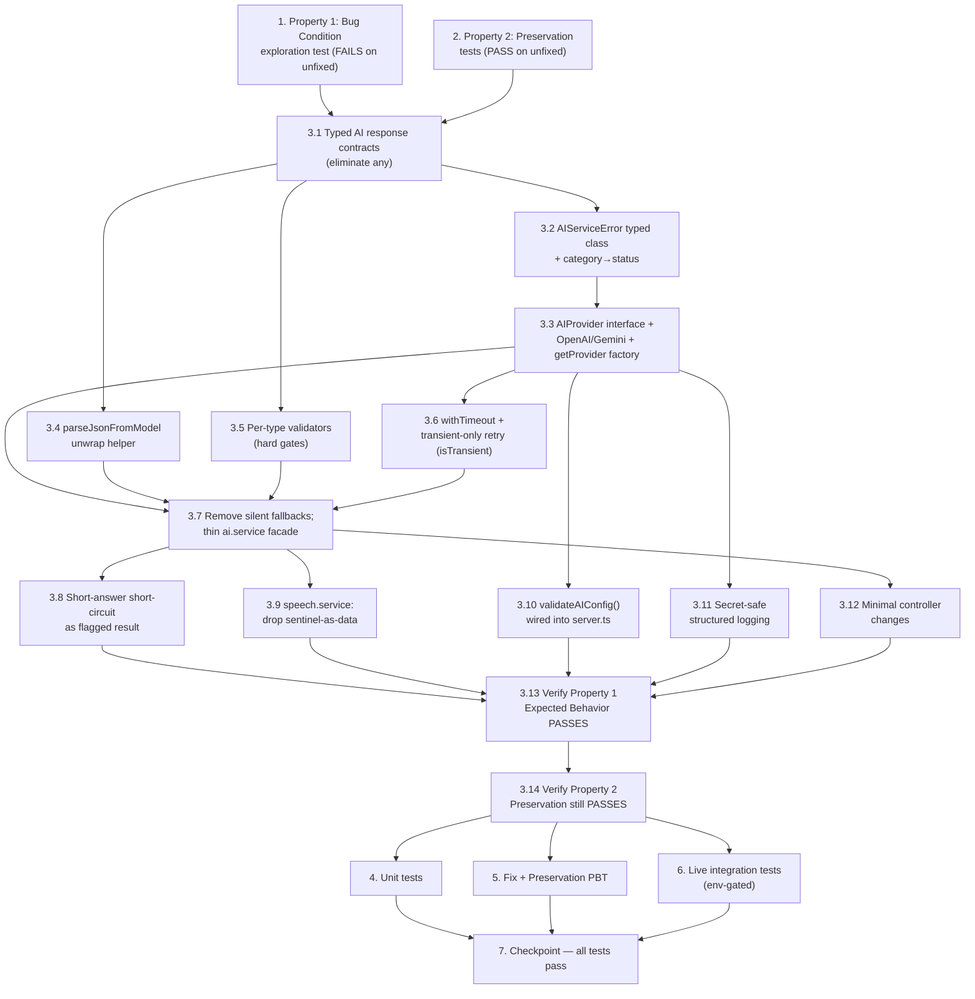

# Implementation Plan

## Overview

This plan follows the exploratory bugfix workflow: **Explore** the bug with a failing test,
**Preserve** existing valid-input behavior with passing tests, **Implement** the fix, then
**Validate** with Fix Checking, Preservation Checking, unit, and live integration tests.

Every implementation task maps to at least one Measurable Acceptance Criterion (AC-1..AC-6) from
the design's "Measurable Acceptance Criteria (per feature)" table and to bugfix.md requirement
clauses (2.1–2.7, 3.1–3.6). Do NOT modify code outside the scope described in the design's
"Changes Required" section.

## Tasks

- [ ] 1. Write bug condition exploration test (Explore — BEFORE the fix)
  - **Property 1: Bug Condition** - No Silent Fallback; Real Differentiated Output
  - **CRITICAL**: This test MUST FAIL on the unfixed code — failure confirms the silent-fallback bug exists
  - **DO NOT attempt to fix the test or the code when it fails** at this stage
  - **NOTE**: This test encodes the expected behavior (explicit typed error on failure); it will validate the fix once it passes after implementation
  - **GOAL**: Surface counterexamples demonstrating that genuine AI/speech failures are masked as fabricated success
  - **Scoped PBT Approach**: For the deterministic failure paths, scope the property to concrete forced-failure cases (invalid key / throwing provider / markdown-wrapped or partial response / transcription failure) so counterexamples are reproducible; use forced-failure mocks only — never mock success
  - Write a property-based test asserting: for all AI feature invocations where `isBugCondition(X)` holds, the fixed code SHALL throw a typed `AIServiceError` and SHALL NOT return/persist a fabricated default. Cover the design's Exploratory test cases:
    - Resume silent-empty: parse a real PDF from `backend/uploads/resumes/` with a forced-throwing/invalid provider — expect an explicit error, not all-empty arrays (bugfix 2.1)
    - Markdown-wrapped / partial JSON: feed a ` ```json … ``` ` or missing-field response — expect `MALFORMED_RESPONSE`, not silent empty fallback (bugfix 2.1, 2.4)
    - Generic questions: `generateQuestions` for Software Engineer, Data Analyst, UI/UX Designer, Product Manager under forced failure — expect error, not identical `getDefaultQuestions` (bugfix 2.2)
    - Identical evaluations: `evaluateAnswer` with excellent/average/poor answers under forced failure and with a partial response to trigger `|| 70` — expect error, not all-70 (bugfix 2.3, 2.4)
    - Transcription fallback: `transcribeAudio` under forced failure — expect `TRANSCRIPTION_FAILED`, not `[Transcription unavailable]` + zeroed `analyzeSpeech` (bugfix 2.5)
    - Provider switch / bad key: `AI_PROVIDER=gemini` then `openai` with an invalid key — expect a meaningful config/auth error, not fabricated defaults (bugfix 2.6)
  - Run the test on UNFIXED code
  - **EXPECTED OUTCOME**: Test FAILS (this is correct — it proves the bug exists)
  - Document the counterexamples found (e.g. "parseResume(validPdf) with bad key returns `{skills:[],…}` instead of throwing AUTH") to confirm/refute the root-cause hypotheses
  - Mark complete when the test is written, run, and the failure is documented
  - _Acceptance Criteria: AC-1, AC-2, AC-3, AC-4, AC-5, AC-6_
  - _Requirements: 2.1, 2.2, 2.3, 2.4, 2.5, 2.6, 2.7_

- [ ] 2. Write preservation property tests (Preserve — BEFORE the fix)
  - **Property 2: Preservation** - Valid-Input Behavior Unchanged
  - **IMPORTANT**: Follow the observation-first methodology — run the UNFIXED code for non-buggy inputs, record actual outputs, then assert them
  - Observe and capture baseline behavior on non-bug-condition inputs (`isBugCondition(X)` false), then write property-based tests asserting it holds across the input domain:
    - Short-answer short-circuit: for all answers with < 10 non-whitespace characters, `evaluateAnswer` does NOT call the provider (bugfix 3.3)
    - `analyzeSpeech` computation: for random valid non-empty transcripts + durations, filler-word count, speech rate, pause count, confidence, and the `ISpeechAnalysis` shape are identical before/after (bugfix 3.4)
    - Score clamping: for valid complete evaluation payloads with out-of-range metrics, numeric scores clamp to 0–100 (bugfix 3.5)
    - Question count/shape: for valid responses, exactly the requested `count` questions in `{ text, type }` shape with valid types (bugfix 3.2)
    - Resume success response shape `{ resumeId, fileUrl, parsedData }` preserved on valid extraction (bugfix 3.1)
    - Non-AI endpoints (auth, analytics, storage) behave byte-for-byte as before (bugfix 3.6)
  - Property-based testing is used here because preservation is a universal property over all non-buggy inputs and catches edge cases manual tests miss
  - Run the tests on UNFIXED code
  - **EXPECTED OUTCOME**: Tests PASS (this confirms the baseline behavior to preserve)
  - Mark complete when tests are written, run, and passing on unfixed code
  - _Acceptance Criteria: AC-1, AC-2, AC-3, AC-4, AC-6_
  - _Requirements: 3.1, 3.2, 3.3, 3.4, 3.5, 3.6_

- [ ] 3. Fix for AI silent-fallback defect (Implement)

  - [ ] 3.1 Add typed AI response contracts and eliminate `any` from the AI path
    - Add `IAIResumeParseResult`, `IAIQuestionsResult`, `IAIEvaluationResult`, `IAITranscriptionResult` to `backend/src/types/index.ts`, wrapping the existing `IResumeParsedData` / `IQuestion` / `IEvaluation` / `ISpeechAnalysis` contracts (with `provider` / `model` / optional `isFallback?: false` metadata)
    - Replace `Promise<any>` return types in `ai.service.ts` and the `resumeData?: any` / `(e: any)` params with the typed contracts (`resumeData?: IResumeParsedData`, typed `experience` element)
    - No `any` types remain in the AI path
    - _Bug_Condition: isBugCondition — providerResponse unparseable/missing fields passes through undetected due to absent typing_
    - _Expected_Behavior: every provider response is typed and validated before return_
    - _Acceptance Criteria: AC-6_
    - _Requirements: 2.7, 3.6_

  - [ ] 3.2 Introduce the `AIServiceError` typed error class
    - Add `AIServiceError extends Error` with `category` (`CONFIG | AUTH | QUOTA | TIMEOUT | MALFORMED_RESPONSE | EMPTY_INPUT | PROVIDER_UNAVAILABLE | TRANSCRIPTION_FAILED`), an HTTP `status`, and secret-free `providerContext` `{ provider, model, durationMs }`
    - Map categories → status: `CONFIG`→500, `AUTH`→502, `QUOTA`→429, `TIMEOUT`→504, `PROVIDER_UNAVAILABLE`→503, `MALFORMED_RESPONSE`→502, `EMPTY_INPUT`→400, `TRANSCRIPTION_FAILED`→502
    - Confirm the existing `error.middleware.ts` consumes `err.status || err.statusCode` with no middleware change
    - _Bug_Condition: isBugCondition — failures are swallowed and never reach error.middleware.ts_
    - _Expected_Behavior: failures propagate as typed errors with meaningful HTTP status_
    - _Acceptance Criteria: AC-6_
    - _Requirements: 2.7_

  - [ ] 3.3 Add the single `AIProvider` interface with OpenAI/Gemini implementations and factory
    - Define the single `AIProvider` interface (`parseResume`, `generateQuestions`, `evaluateAnswer`, `transcribeAudio`)
    - Implement `OpenAIProvider` (`gpt-4o-mini` + `whisper-1`) and `GeminiProvider` (`gemini-1.5-flash`) as the ONLY modules importing the OpenAI / `@google/generative-ai` SDKs; encapsulate model selection and prompt assembly
    - Add `getProvider(AI_PROVIDER)` factory that re-reads `AI_PROVIDER` per call and throws `AIServiceError('CONFIG')` for unknown values
    - _Bug_Condition: isBugCondition — provider selection captured once at module load; SDK branching scattered inline_
    - _Expected_Behavior: switching AI_PROVIDER routes calls with no code change_
    - _Acceptance Criteria: AC-5, AC-6_
    - _Requirements: 2.6, 2.7_

  - [ ] 3.4 Add the robust `parseJsonFromModel` unwrap helper
    - Strip markdown code fences (` ```json … ``` `), trim surrounding prose, and parse; on unrecoverable input throw `AIServiceError('MALFORMED_RESPONSE')`
    - Replace the fragile `/\{[\s\S]*\}/` / `/\[[\s\S]*\]/` regex recovery
    - _Bug_Condition: isBugCondition — markdown-wrapped/prose-wrapped JSON defeats the regex and falls back silently_
    - _Expected_Behavior: robust unwrap+parse, or explicit MALFORMED_RESPONSE_
    - _Acceptance Criteria: AC-1, AC-6_
    - _Requirements: 2.1, 2.7_

  - [ ] 3.5 Add per-type response validators as hard gates before persistence
    - `validateResumeParse`: all five fields exist and are arrays; reject an all-empty parse when source `rawText` is non-empty (→ `MALFORMED_RESPONSE`)
    - `validateQuestions(raw, count)`: non-empty `{ text, type }[]`, valid `type ∈ {behavioral, technical, hr}`, `>= count` items, `slice(0, count)` on over-generation, no generic default padding
    - `validateEvaluation`: all six numeric metrics exist and are numbers (no `|| 70`), clamped 0–100, `strengths`/`improvements` string arrays
    - `validateTranscription`: non-empty transcript, not the `[Transcription unavailable]` sentinel
    - Validators run inside the provider layer immediately after unwrap/parse, before any controller/DB access
    - _Bug_Condition: isBugCondition — parsed objects never validated against contracts before persistence_
    - _Expected_Behavior: malformed/empty responses rejected as typed errors, never persisted_
    - _Acceptance Criteria: AC-1, AC-2, AC-3, AC-4, AC-6_
    - _Requirements: 2.1, 2.2, 2.3, 2.4, 2.5, 2.7_

  - [ ] 3.6 Add `withTimeout` and transient-only retry (`isTransient`)
    - Wrap each provider call in `withTimeout(ms)` (configurable `AI_TIMEOUT_MS`, default ~20s)
    - Bounded retry (1–2, exponential backoff) that fires ONLY for `TIMEOUT`, `PROVIDER_UNAVAILABLE`, and `QUOTA` (429 → backoff)
    - `isTransient(category)` helper ensures `AUTH`, `CONFIG`, `EMPTY_INPUT`, `MALFORMED_RESPONSE` are NEVER retried (a retry cannot mask a deterministic failure)
    - _Bug_Condition: isBugCondition — deterministic failures previously masked; no retry seam_
    - _Expected_Behavior: only transient failures retried; deterministic failures surface immediately_
    - _Acceptance Criteria: AC-5, AC-6_
    - _Requirements: 2.6, 2.7_

  - [ ] 3.7 Remove silent fallbacks and make `ai.service.ts` a thin facade
    - Delete `getDefaultResumeData` / `getDefaultQuestions` / `getDefaultEvaluation` and the `if (jsonMatch) {…} else return getDefault*` branches
    - Drop inline SDK imports and `provider === 'gemini'` branching; delegate to `getProvider().<method>(...)`, unwrapping `parsedData`/`questions`/`evaluation`/`transcript` to preserve existing controller success-path shapes
    - Fix `parseResume` (return validated `IResumeParsedData` or throw), `generateQuestions` (validated `{ text, type }[]`, preserve resume-enrichment + `slice(0, count)`, no default padding), `evaluateAnswer` (remove `|| 70`; require six numeric metrics or `MALFORMED_RESPONSE`; retain 0–100 clamping + strengths/improvements validation), `transcribeAudio` (throw `TRANSCRIPTION_FAILED` on failure; keep file-not-found throw; return real transcript only)
    - _Bug_Condition: isBugCondition — catch→getDefault* returns and `|| 70` coercion mask failures as success_
    - _Expected_Behavior: each former fallback resolves to validated success OR typed error, never fabricated success_
    - _Acceptance Criteria: AC-1, AC-2, AC-3, AC-6_
    - _Requirements: 2.1, 2.2, 2.3, 2.4, 2.7_

  - [ ] 3.8 Preserve the short-answer short-circuit as an explicit flagged result
    - Keep the sub-10 non-whitespace-character short-circuit without calling the provider, but return a clearly-flagged minimal evaluation (or validation error) — never the fabricated all-70 default
    - _Bug_Condition: isBugCondition false for short answers, but current path returns fabricated 70_
    - _Expected_Behavior: short-circuit preserved; result explicitly flagged, not a fabricated 70_
    - _Acceptance Criteria: AC-3_
    - _Requirements: 3.3, 2.4_

  - [ ] 3.9 Stop treating the transcription sentinel as data in `speech.service.ts`
    - Remove the `[Transcription unavailable]` special-case in `analyzeSpeech` (the error now propagates from `transcribeAudio` before reaching it); keep the empty-string guard only where genuinely reachable
    - Preserve all `analyzeSpeech` computation and the `ISpeechAnalysis` shape for valid transcriptions unchanged
    - _Bug_Condition: isBugCondition — sentinel + zeroed metrics propagated as fake success_
    - _Expected_Behavior: metrics computed only from valid transcriptions; failures surface upstream_
    - _Acceptance Criteria: AC-4_
    - _Requirements: 2.5, 3.4_

  - [ ] 3.10 Wire fail-fast `validateAIConfig()` into `server.ts` startup
    - Expand/export `validateAIConfig()`; invoke during `startServer()` BEFORE accepting traffic
    - Fail fast (abort startup with a clear `CONFIG` error) on missing/invalid `AI_PROVIDER`, absent/empty selected-provider key (`OPENAI_API_KEY` / `GEMINI_API_KEY`), or invalid model/timeout config (`OPENAI_MODEL` / `GEMINI_MODEL` / `AI_TIMEOUT_MS`)
    - Validate presence and shape only; never log key values
    - _Bug_Condition: isBugCondition — missing/invalid key only manifests as swallowed runtime failure_
    - _Expected_Behavior: misconfiguration fails fast at boot with a meaningful config error_
    - _Acceptance Criteria: AC-5_
    - _Requirements: 2.6_

  - [ ] 3.11 Add secret-safe structured logging
    - Centralize AI logging through one secret-safe structured logger recording: `provider`, `model`, `durationMs` (latency), retry count (`attempt`/`retries`), `promptChars`/`responseChars`, outcome, and on failure the parsing/validation `errorCategory`
    - NEVER emit API keys, JWTs/tokens, raw resume content, answer text, audio bytes, or PII — only sizes and categories; failures at `error`, retries at `warn`, successes at `info`/`debug`
    - _Bug_Condition: isBugCondition — failures logged only to console.error, no structured signal_
    - _Expected_Behavior: every AI call observable with secret-safe structured logs_
    - _Acceptance Criteria: AC-6_
    - _Requirements: 2.7, 3.6_

  - [ ] 3.12 Apply minimal controller changes to propagate typed errors
    - `resume.controller.ts`: let the thrown `AIServiceError` from `parseResume` propagate to `errorHandler`; do NOT persist a resume document on parse failure; preserve the existing empty-text 400 and the `{ resumeId, fileUrl, parsedData }` success shape
    - `interview.controller.ts`: let `AIServiceError` from `generateQuestions`/`evaluateAnswer`/`transcribeAudio` surface with its typed status in `startInterview`/`submitTextAnswer`/`submitVoiceAnswer`; a voice transcription failure aborts submission (no zeroed `speechAnalysis` persisted); keep averaging/persistence/completion/`saveAnalytics` unchanged for successful answers
    - _Bug_Condition: isBugCondition — controllers persist fabricated data as success_
    - _Expected_Behavior: typed errors propagate; nothing fabricated is persisted; success shapes preserved_
    - _Acceptance Criteria: AC-1, AC-3, AC-4, AC-6_
    - _Requirements: 2.1, 2.3, 2.5, 3.1, 3.6_

  - [ ] 3.13 Verify the bug condition exploration test now passes
    - **Property 1: Expected Behavior** - No Silent Fallback; Real Differentiated Output
    - **IMPORTANT**: Re-run the SAME property test from task 1 — do NOT write a new test
    - The test from task 1 encodes the expected behavior; passing confirms buggy inputs surface typed errors and valid inputs produce real, input-reflecting, differentiated output
    - Run the bug condition exploration test from task 1
    - **EXPECTED OUTCOME**: Test PASSES (confirms the bug is fixed)
    - _Acceptance Criteria: AC-1, AC-2, AC-3, AC-4, AC-5, AC-6_
    - _Requirements: 2.1, 2.2, 2.3, 2.4, 2.5, 2.6, 2.7_

  - [ ] 3.14 Verify the preservation tests still pass
    - **Property 2: Preservation** - Valid-Input Behavior Unchanged
    - **IMPORTANT**: Re-run the SAME tests from task 2 — do NOT write new tests
    - Run the preservation property tests from task 2
    - **EXPECTED OUTCOME**: Tests PASS (confirms no regressions on valid-input behavior)
    - _Acceptance Criteria: AC-1, AC-2, AC-3, AC-4, AC-6_
    - _Requirements: 3.1, 3.2, 3.3, 3.4, 3.5, 3.6_

- [ ] 4. Write unit tests (deterministic, forced-failure mocks only for error paths)
  - Typed error mapping: each `AIServiceError.category` maps to its expected HTTP status via `error.middleware.ts`
  - `parseJsonFromModel`: unwraps fenced/pretty/prose-wrapped JSON; throws `MALFORMED_RESPONSE` on unrecoverable input
  - `evaluateAnswer`: missing metric field → `MALFORMED_RESPONSE` (no `|| 70`); all-present → clamped, validated result
  - `transcribeAudio`: forced failure → `TRANSCRIPTION_FAILED`; file-not-found → existing throw
  - `validateAIConfig`: missing key / unknown `AI_PROVIDER` / invalid model config → `CONFIG` error at startup
  - _Acceptance Criteria: AC-3, AC-4, AC-5, AC-6_
  - _Requirements: 2.4, 2.5, 2.6, 2.7_

- [ ] 5. Write Fix Checking and Preservation property-based tests
  - Fix Checking: generate random forced-failure invocations where `isBugCondition(X)` holds and assert a typed `AIServiceError` is thrown (no fabricated default returned/persisted)
  - Preservation (PBT): generate random valid evaluation payloads and assert clamping + validation invariants (bugfix 3.5); generate random valid transcriptions and assert `analyzeSpeech` output equals the original implementation (bugfix 3.4); generate random short answers and assert the no-provider-call short-circuit (bugfix 3.3)
  - _Acceptance Criteria: AC-3, AC-4, AC-6_
  - _Requirements: 2.7, 3.3, 3.4, 3.5_

- [ ] 6. Write live integration tests (gated behind an env flag; forced-failure mocks only for error paths)
  - Live resume parse: upload each real PDF in `backend/uploads/resumes/` with a valid provider; assert non-empty, contract-valid `parsedData` (≥ one skill), persisted, preserved response shape (AC-1)
  - Live question differentiation: request questions for multiple roles/types/difficulties; assert outputs differ across roles and match requested `count`/type (AC-2)
  - Live evaluation variance: submit excellent/average/poor answers; assert scores vary meaningfully and are not all-70 (AC-3)
  - Live voice flow: submit a real audio recording; assert real transcript, computed `ISpeechAnalysis` (WPM, filler count, pause count, confidence), and valid `IEvaluation`; on forced transcription failure assert submission aborts with an explicit error and persists nothing (AC-4)
  - Provider switch: run resume + question + evaluation suite with `AI_PROVIDER=openai` then `gemini` (valid keys) with no code change; with an invalid key assert a meaningful config/auth error instead of defaults (AC-5)
  - Live tests are gated behind an env flag to balance fidelity, cost, and CI stability; use forced-failure mocks only for the deterministic error paths
  - _Acceptance Criteria: AC-1, AC-2, AC-3, AC-4, AC-5_
  - _Requirements: 2.1, 2.2, 2.3, 2.5, 2.6, 3.1, 3.2_

- [ ] 7. Checkpoint - Ensure all tests pass
  - Run the full suite: exploration test (Property 1, now passing), preservation tests (Property 2), unit tests, property-based tests, and env-gated live integration tests
  - Confirm no regressions to non-AI endpoints (auth, analytics, storage)
  - Ensure all tests pass; ask the user if questions arise
  - _Acceptance Criteria: AC-1, AC-2, AC-3, AC-4, AC-5, AC-6_
  - _Requirements: 2.1, 2.2, 2.3, 2.4, 2.5, 2.6, 2.7, 3.1, 3.2, 3.3, 3.4, 3.5, 3.6_

## Task Dependency Graph

Tasks 1–2 run on the UNFIXED code first (1 must fail, 2 must pass). The fix (3) starts with the
typed contracts (3.1) and error class (3.2) that everything depends on, then the provider layer and
helpers (3.3–3.6), the removal of silent fallbacks and behavior preservation (3.7–3.9),
config/observability (3.10–3.11), controller propagation (3.12), and the two verification sub-tasks
(3.13–3.14) that re-run Property 1 and Property 2. Additional testing (4–6) runs after the fix; the
checkpoint (7) gates on all of them.

Execution waves (each wave may run in parallel; a wave depends on all prior waves):

```json
{
  "waves": [
    {
      "wave": 1,
      "description": "Explore and preserve on UNFIXED code (baseline lock-in)",
      "tasks": ["1", "2"]
    },
    {
      "wave": 2,
      "description": "Foundational typed contracts and error class",
      "tasks": ["3.1", "3.2"]
    },
    {
      "wave": 3,
      "description": "Provider layer, unwrap helper, validators, timeout/retry",
      "tasks": ["3.3", "3.4", "3.5", "3.6"]
    },
    {
      "wave": 4,
      "description": "Remove silent fallbacks, preserve behavior, config, observability",
      "tasks": ["3.7", "3.8", "3.9", "3.10", "3.11"]
    },
    {
      "wave": 5,
      "description": "Controller propagation of typed errors",
      "tasks": ["3.12"]
    },
    {
      "wave": 6,
      "description": "Verify Property 1 (Expected Behavior) then Property 2 (Preservation)",
      "tasks": ["3.13", "3.14"]
    },
    {
      "wave": 7,
      "description": "Unit, property-based, and env-gated live integration tests",
      "tasks": ["4", "5", "6"]
    },
    {
      "wave": 8,
      "description": "Final checkpoint — all tests pass",
      "tasks": ["7"]
    }
  ]
}
```



## Notes

- **Ordering:** Tasks 1 and 2 must be authored and executed against the unfixed code before any fix
  work — task 1 must FAIL (proving the bug) and task 2 must PASS (locking the baseline).
- **Scope discipline:** Only the files named in the design's "Changes Required" section are
  touched: `backend/src/types/index.ts`, `backend/src/services/ai.service.ts`,
  `backend/src/services/speech.service.ts`, `backend/src/controllers/resume.controller.ts`,
  `backend/src/controllers/interview.controller.ts`, and `backend/src/server.ts`. No DB schema or
  API success-shape changes.
- **Testing fidelity:** Live OpenAI/Gemini calls, real PDFs from `backend/uploads/resumes/`, and
  real voice recordings are used wherever feasible; mocks are used ONLY to force failures for
  deterministic error-path tests, never to simulate success. Live integration tests are gated
  behind an env flag for cost/CI stability.
- **Acceptance mapping:** Every implementation and test task above references at least one
  measurable criterion (AC-1..AC-6) and the corresponding bugfix.md clauses, satisfying the
  design's Clause-Level Traceability table.
