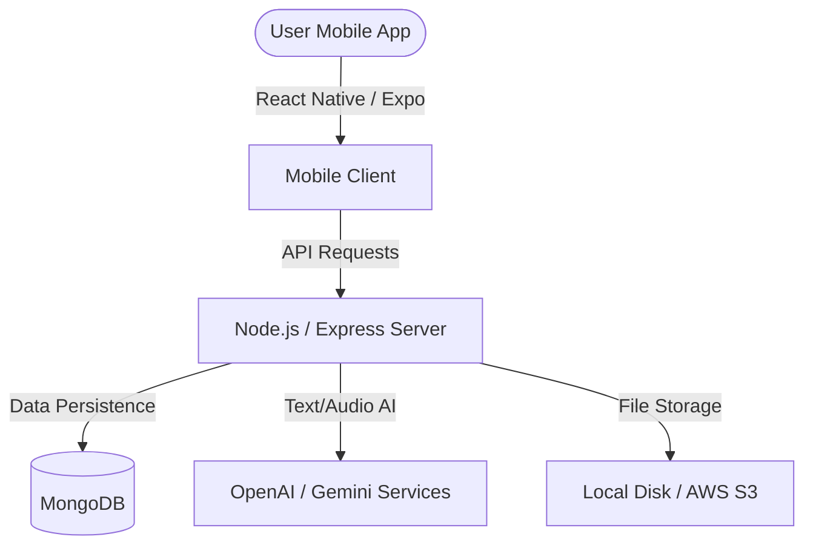

# AI Interview Coach

AI Interview Coach is a premium, cross-platform mobile application designed to help job seekers and students prepare for interviews. Built with **React Native (Expo + TypeScript)** and a **Node.js/Express + MongoDB** backend, it leverages state-of-the-art AI language models (OpenAI GPT-4o-mini & Google Gemini) to deliver realistic mock interviews, real-time audio transcription, speech metrics analysis, and granular performance tracking.

## System Architecture



---

## Features

- **Personalized Setup:** Customizes interviews by target job role, difficulty (Beginner, Intermediate, Advanced), type (Behavioral, Technical, HR, Mixed), and duration.
- **Resume Parsing & Alignment:** Automatically extracts skills, experience, education, projects, and certifications from PDF/DOCX resumes and tailors mock interview questions directly to the candidate's actual profile.
- **Dual Interview Modes:** Supports both chat-based text interviews and immersive speech-based voice interviews.
- **Speech Diagnostics:** Detects speech pace (WPM), hesitation pauses, and counts filler words (e.g., *um*, *uh*, *like*, *basically*), producing a speech confidence score.
- **Granular AI Evaluations:** Score breakdown across 5 dimensions (Relevance, Clarity, Communication, Technical Accuracy, Confidence) with bulleted lists of key strengths and actionable improvements.
- **Interactive Analytics:** Performance progress charts, skill breakdowns, confidence trends, and filler-word history trackers built with `react-native-chart-kit`.

---

## Technology Stack

### Frontend (Mobile App)
- **Framework:** React Native + Expo (TypeScript)
- **Navigation:** React Navigation (Native Stack + Bottom Tabs)
- **State Management:** React Context (Auth, Interview)
- **Audio Processing:** `expo-av` (recording) & `expo-document-picker`
- **Charts:** `react-native-chart-kit` & `react-native-svg`
- **Styling:** Vanilla StyleSheet (Premium Glassmorphism + Dark Mode Theme)

### Backend (API Server)
- **Runtime:** Node.js + Express (TypeScript)
- **Database:** MongoDB + Mongoose
- **AI Integration:** OpenAI API (GPT-4o-mini & Whisper) & Google Generative AI (Gemini 1.5 Flash)
- **Parsers:** `pdf-parse` (PDF) & `mammoth` (Word/DOCX)
- **File Upload:** Multer (with diskStorage)
- **Security:** JWT Authentication, Helmet, CORS, and Express Rate Limiting

---

## Getting Started

### Prerequisites
- Node.js (v18+)
- MongoDB running locally (or MongoDB Atlas URI)
- API key for OpenAI or Google Gemini

### Backend Installation & Setup

1. Navigate to the backend directory:
   ```bash
   cd backend
   ```

2. Install dependencies:
   ```bash
   npm install
   ```

3. Create your `.env` file from the example:
   ```bash
   cp .env.example .env
   ```

4. Configure the variables in `.env`:
   ```env
   PORT=5000
   MONGODB_URI=mongodb://localhost:27017/ai-interview-coach
   JWT_SECRET=your-super-secret-key-here
   JWT_EXPIRES_IN=7d
   
   # AI Provider: 'openai' or 'gemini'
   AI_PROVIDER=gemini
   OPENAI_API_KEY=your-openai-api-key
   GEMINI_API_KEY=your-gemini-api-key
   
   # Storage: 'local' or 's3'
   STORAGE_PROVIDER=local
   AWS_ACCESS_KEY_ID=your-aws-key
   AWS_SECRET_ACCESS_KEY=your-aws-secret
   AWS_REGION=us-east-1
   AWS_S3_BUCKET=ai-interview-coach-files
   
   NODE_ENV=development
   ```

5. Start the server in development mode:
   ```bash
   npm run dev
   ```

### Frontend Installation & Setup

1. Navigate to the frontend directory:
   ```bash
   cd frontend
   ```

2. Install dependencies:
   ```bash
   npm install
   ```

3. Run the Expo packager:
   ```bash
   npx expo start
   ```

4. Run on a virtual simulator (press `i` for iOS, `a` for Android) or scan the QR code using the Expo Go app on your phone.

---

## API Endpoints Directory

### Authentication
- `POST /api/auth/register` - Create account & generate JWT token.
- `POST /api/auth/login` - Validate credentials & return token.
- `GET /api/auth/profile` - Retrieve active user account data.
- `PUT /api/auth/profile` - Update user name, role, and experience level.

### Resume Parser
- `POST /api/resume/upload` - Parse PDF/DOCX and update profile.
- `GET /api/resume/me` - Fetch latest parsed resume profile.
- `GET /api/resume/:id` - Fetch specific resume record.

### Mock Interview
- `POST /api/interview/start` - Initialize mock session & get first question.
- `POST /api/interview/:interviewId/answer/text` - Submit text response & get next question.
- `POST /api/interview/:interviewId/answer/voice` - Submit voice audio, transcribe, analyze, and get next question.
- `GET /api/interview/history` - Fetch recent mock sessions list.
- `GET /api/interview/:id` - Retrieve full evaluation transcript.

### Analytics Dashboard
- `GET /api/analytics/dashboard` - Get overall progress stats & charts datasets.
- `GET /api/analytics/interview/:id` - Get specific session metrics.

---

## Speech Metrics Formulation

The speaking confidence score (0-100) is evaluated mathematically on the server:

$$\text{Confidence Score} = 100 - (\text{Filler Penalty} + \text{Pace Penalty} + \text{Hesitation Penalty}) + \text{Diversity Bonus}$$

1. **Filler Penalty:** Deducts 3 points per filler word detected (*um, uh, like, well, basically, actually*), up to a max penalty of 30.
2. **Pace Penalty:** Optimal pace is 120-180 words per minute (WPM).
   - < 80 WPM: Deducts 20 points (Too slow).
   - 80-110 WPM: Deducts 10 points (Slightly slow).
   - > 200 WPM: Deducts 15 points (Too fast).
   - 180-200 WPM: Deducts 5 points (Slightly fast).
3. **Hesitation Penalty:** Counts pauses based on punctuation transitions. Excess pauses deduct 2 points each, up to a max of 20.
4. **Diversity Bonus:** A variety of unique words (diversity ratio > 0.6) yields a +5 bonus.
